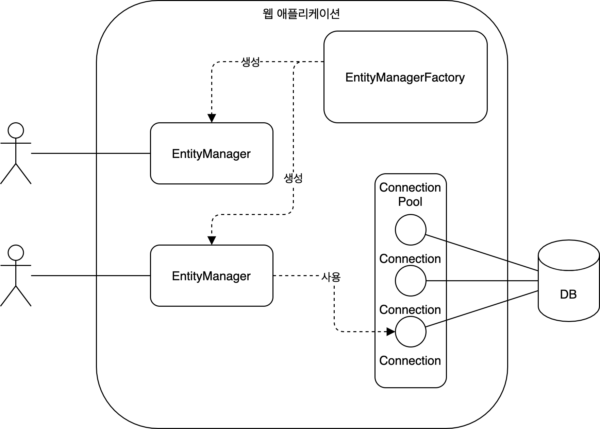
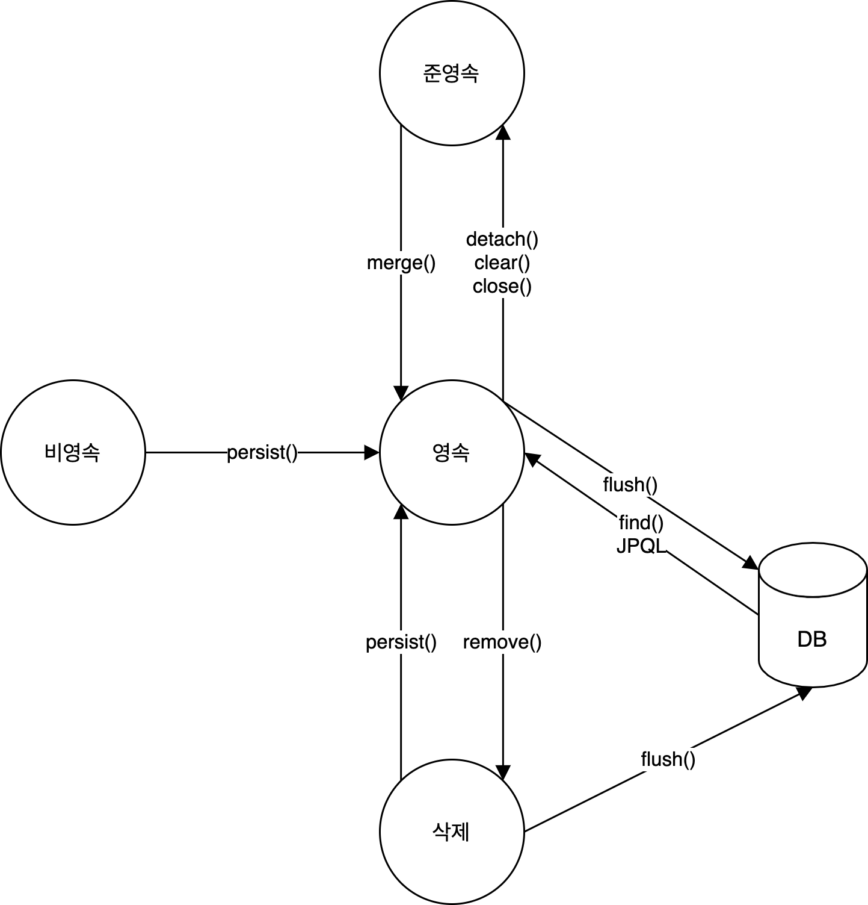

## 03 영속성 관리

### EntityManagerFactory와 EntityManager

JPA는 **엔티티와 테이블을 매핑**하는 기능과 **매핑한 엔티티를 사용**하는 기능을 제공한다. `EntityManagerFactory`와 `EntityManger`는 매핑한 엔티티를 사용하기 위해 필요하다.

`EntityManagerFactory`는 EntityManager를 생성한다. EntityMangerFactory는 생성하는데 많은 자원이 필요하므로 애플리케이션에서 한 개만 생성한다. 대신 여러 스레드가 공유할 수 있다.

`EntityManger`는 엔티티를 실질적으로 관리한다. EntityManagerFactory에서 EntityManager를 생성하는 데는 많은 자원이 필요하지 않다. 동시성 문제 발생을 막기 위해 여러 스레드가 공유하지 않도록 요청이 있을 때마다 생성한다. EntityManager가 생성되면 `영속성 컨텍스트(Persistence Context)`도 같이 만들어진다. 영속성 컨텍스트는 엔티티를 영구 저장하는 환경이다.

### 영속성 컨텍스트(Persistence Context) 사용

엔티티 매니저는 `영속성 컨텍스트(Persistence Context)`에 엔티티를 보관하고 관리한다. 영속성 컨텍스트에서 엔티티가 관리되면 다음과 같은 장점이 있다.

1. 1차 캐시  
엔티티 매니저가 엔티티를 조회할 때 영속성 컨텍스트를 먼저 확인하고 데이터베이스를 조회한다. 영속성 컨텍스트는 1차 캐시로서 데이터베이스에 직접 조회하는 횟수를 줄일 수 있다.

2. 동일성 보장  
엔티티 매니저가 엔티티를 조회할 때 영속성 컨텍스트에서 가져온다. 따라서 동일한 식별자 값을 가진 엔티티는 동일한 객체이다.

3. 트랜잭션을 지원하는 쓰기 지연  
엔티티 매니저가 엔티티를 저장할 때 데이터베이스 쓰기(INSERT, UPDATE, DELETE) 쿼리는 바로 실행되지 않고 쓰기 지연 저장소에 저장된다. 쿼리는 트랜잭션이 커밋될 때 영속성 컨텍스트와 데이터베이스가 동기화되면서 실행된다.

4. 변경 감지  
엔티티 매니저가 엔티티의 필드 값을 변경할 때 영속성 컨텍스트에서는 스냅샷을 통해 변경 내용을 관리한다. 최초에 저장된 엔티티의 상태를 스냅샷에서 관리한다. 영속성 컨텍스트의 내용이 데이터베이스와 동기화될 때, 영속성 컨텍스트의 엔티티와 스냅샷을 비교해서 UPDATE 쿼리를 실행한다. 

5. 지연 로딩

### 플러시(flush)

플러시(flush)는 영속성 컨텍스트와 데이터베이스를 동기화하는 작업이다. 플러시는 다음과 같은 상황에서 발생한다.

1. 엔티티 매니저가 flush() 함수를 호출한다.
2. 트랜잭션을 커밋한다.
3. JPQL 쿼리를 실행한다. JPQL 쿼리는 데이터베이스에 직접 실행된다. 따라서 영속성 컨텍스트의 내용이 데이터베이스와 동기화되지 않는다면 JPQL 쿼리는 올바르지 않은 결과를 반환한다.

### 엔티티 생명주기

엔티티는 다음과 같은 상태를 가진다.

1. 비영속: 영속성 컨텍스트에서 관리되지 않은 엔티티
2. 영속: 연속성 컨텍스트에서 관리되는 엔티티. 비영속이나 준영속의 엔티티는 persist() 메서드 또는 merge() 메서드로 영속 상태가 된다. 영속성 컨텍스트에서 관리되는 엔티티는 플러시 과정을 통해서 데이터베이스와 동기화된다.
3. 준영속: 영속 상태였던 엔티티가 더 이상 영속성 컨텍스트에 의해서 관리되지 않는 상태. 
4. 삭제: 영속성 컨텍스트와 데이터베이스에서 엔티티가 삭제된 상태. 영속성 컨텍스트에서 삭제된 데이터는 플러시 과정을 통해 데이터베이스와 동기화된다.

